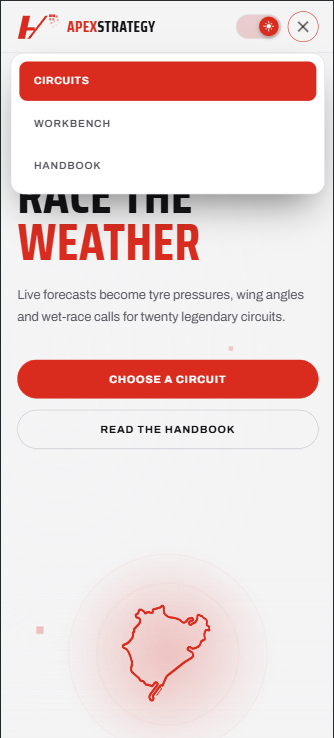
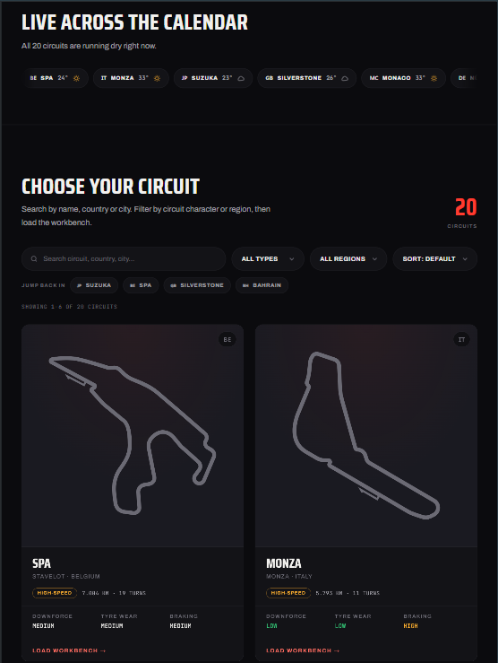
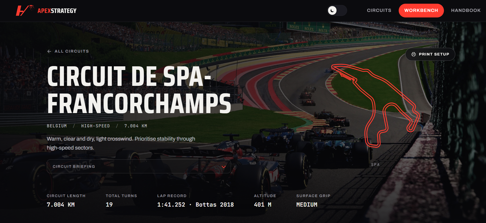

# ApexStrategy

**A weather-driven race-engineering tool that turns live forecasts into tyre, aero, and wet-strategy setup calls for twenty legendary circuits.**

- **Author:** Joe Abou Absi
- **Course:** Full Stack Development — Final Project 2026 (Lebanese University, Faculty of Engineering, Branch 2 — Roumieh)
- **Live site:** https://apexstrategy-nine.vercel.app
- **Repository:** https://github.com/joeabouabsi04/apexstrategy

---

## Table of Contents

1. [What it is](#what-it-is)
2. [API used](#api-used)
3. [Custom UI requirement](#custom-ui-requirement)
4. [Pages & features](#pages--features)
5. [Requirements checklist](#requirements-checklist)
6. [Tech stack](#tech-stack)
7. [Project structure](#project-structure)
8. [Running it locally](#running-it-locally)
9. [Deployment (Vercel)](#deployment-vercel)
10. [Screenshots](#screenshots)
11. [AI-use appendix](#ai-use-appendix)

---

## What it is

ApexStrategy is a motorsport race-engineering platform. You pick one of twenty real racing circuits, and the site pulls the **live weather** for that exact location and computes an engineering setup for the car: tyre pressures and compound, front/rear wing angles and drag, and a full wet-weather strategy when rain is on the way. You can flip between the four sessions of a race weekend (Live, Practice +24h, Qualifying +48h, Race +72h) and watch the recommendation change with the forecast, all without a page reload.

Every recommendation is computed from two things: the circuit's real engineering profile (downforce demand, tyre wear, braking load, altitude, surface grip) and the sky above it, fetched from OpenWeatherMap. The theme (weather-driven race engineering) is built on real content — no placeholder text anywhere.

---

## API used

**[OpenWeatherMap](https://openweathermap.org/api)** (free tier, registration + API key required). Two endpoints are used:

- **Current Weather** — live conditions at each circuit's GPS coordinates.
- **5-day / 3-hour Forecast** — sliced into the four race-weekend sessions and the home-page live radar.

**The API key is never exposed.** In production the site calls a small **Vercel serverless proxy** (`api/weather.js`) that injects the key from a server-side environment variable, so the key never ships to the browser or lives in the repository. In local development the app reads the key from a git-ignored `js/config.js` file. See [Deployment](#deployment-vercel).

The API data drives styled, user-friendly interfaces with proper **loading** (skeleton placeholders shaped like the real panels), **error** (inline message + retry button), and **empty** (no-results) states.

---

## Custom UI requirement

**My assigned requirement: _Implement tabbed navigation using JavaScript._**

This is implemented as a reusable ES6 class, **`TabController`** (`js/TabController.js`), with **no Bootstrap tab attributes and no jQuery** — it drives everything through the DOM. It is used in two places:

- The **Workbench** page — Tyres, Aerodynamics, and Wet Strategy tabs.
- The **Handbook** page — Terminology, Tyre Compounds, Aerodynamics, and Track Types chapters.

The class handles: active-tab / active-pane state, full **ARIA** roles (`tablist` / `tab` / `tabpanel`, `aria-selected`, `aria-controls`), **arrow-key / Home / End keyboard navigation**, a mobile **horizontal-scroll affordance** (edge fades when the tab row overflows, plus auto-scroll of the active tab into view), and a `tabchange` custom event so other code can react to switches.

The requirement is explained in a code comment at the top of `js/TabController.js` and in the HTML where the tab markup lives (see the `CUSTOM UI REQUIREMENT` comments in `workbench.html` and `handbook.html`).

---

## Pages & features

The site has **four HTML pages** with a consistent, always-visible navigation bar and footer (both injected as custom elements from `js/nav.js` and `js/footer.js`, so there is one single source of truth).

### 1. Home — `index.html`

- **Cinematic hero** with a bespoke **Three.js** 3D "telemetry floor" background and a spinning 3D circuit outline.
- **Stats band** and a **"How it works"** story section (scroll-reveal on entry).
- **Live calendar radar** — one cached burst fetches the current weather at all twenty circuits (cached in `sessionStorage` for 10 minutes) and renders a scrollable ribbon; wet circuits are sorted first, tinted amber and pulsing, with a plain-language summary line.
- **Recently viewed** chips — the last circuits you opened, remembered in `localStorage`.
- **Circuit browser** with **client-side search** (name / country / city / region / type), **type + region filtering**, **sorting** (name, length, turns), and **pagination** (6 circuits per page). Each card shows the real track outline (inlined SVG), 3D tilt on hover, and demand stats.

### 2. Workbench — `workbench.html`

- **Circuit hero** with the circuit identity, a plain-language conditions verdict, a large animated **track map** (draws itself in, with a lapping marker and 3D tilt), and an optional **circuit photo backdrop** (`images/circuits/{id}.jpg`).
- **Race Weekend session cards** — each of the four sessions (Live / Practice / Quali / Race) shows its forecast (glyph, temperature, rain chance) right on the button; wet sessions are tinted amber. Click a session to recompute the whole setup for that forecast. The active session is written into the URL (`?session=race`) so the exact view is **shareable / deep-linkable**.
- **Live conditions card** with a **°C / °F units toggle** (converts temperatures and wind km/h ↔ mph, remembered in `localStorage`) and a weather condition glyph.
- **Three tabs** (the custom UI requirement): **Tyres & Pressures** (pressures in PSI + kPa, compound choice with a coloured tyre glyph, track-condition remarks, and a projected **degradation SVG chart**), **Aerodynamics** (wing angles, drag, wind analysis, DRS, engineering notes), and **Wet Strategy** (dry/intermediate/full-wet plan with rainfall, aquaplaning risk, brake bias, engine map).
- **Expandable circuit briefing** (curated description), **skeleton loading**, **error + retry**, a live **data-age** timer, a **rain canvas** overlay when it's raining, and a **Print setup sheet** button (a dedicated `@media print` stylesheet renders all three tabs as a clean one-page pit-wall sheet).

### 3. Handbook — `handbook.html`

- Four **data-driven tabbed chapters** built by looping over `js/handbook-data.js` — Terminology (12 glossary terms), Tyre Compounds (7 Pirelli compounds with rating bars), Aerodynamics (3 sections), and Track Types (4 classifications).
- **Live search** across every chapter with **Ctrl+F-style match highlighting**, per-chapter match counts on the tabs, and per-chapter empty states.

### 4. Not Found — `404.html`

- A branded "OFF TRACK" page (served automatically by Vercel for unknown URLs) with a route back to the circuits.

### Site-wide

- **Light / dark mode** with an animated sliding-knob switch (preference saved to `localStorage`; the Three.js scene and all components recolour live).
- **Custom themed dropdowns** (`js/ApexSelect.js`) — the native `<option>` popup can't be styled, so the selects are progressively enhanced into themed, keyboard-accessible listboxes while the real `<select>` stays the source of truth.
- **Keyboard shortcuts** (`/` focus search, `R` refetch, `1`/`2`/`3` switch tabs, `?` show hints).
- Motion (count-up numbers, scramble-decode text, scroll reveals, shimmering skeletons) that fully respects `prefers-reduced-motion`.
- Responsive from 320px phones to widescreen, tested at mobile / tablet / desktop.

---

## Requirements checklist

| Requirement                    | Where it's met                                                                         |
| ------------------------------ | -------------------------------------------------------------------------------------- |
| Semantic HTML5                 | `header`, `nav`, `main`, `section`, `article`, `footer` throughout                     |
| Hand-written CSS3              | single `css/style.css` design system with CSS custom properties                        |
| Flexbox + Bootstrap 5          | Flexbox + CSS Grid everywhere; Bootstrap 5 grid for the circuit card layout            |
| Responsive design              | mobile / tablet / desktop breakpoints, no horizontal overflow at 320px                 |
| ES6 classes only               | all logic is ES6 classes / modules; `const`/`let`, no `var`, no jQuery                 |
| Real JS functionality          | live API, dynamic rendering, search/filter/sort/pagination, tabs, unit + theme toggles |
| Min. 3 pages + consistent nav  | 4 pages (Home, Workbench, Handbook, 404) + shared nav/footer on all                    |
| Public API with key            | OpenWeatherMap (registration + key)                                                    |
| Search / filter / pagination   | **all three** on Home, plus search on Handbook                                         |
| Loading / error / empty states | skeleton loader, error + retry, empty results                                          |
| 15+ curated items              | **20** real circuits + a full handbook dataset                                         |
| Unique UI requirement          | tabbed navigation via the `TabController` ES6 class                                    |
| Free live deployment           | Vercel (serverless proxy keeps the API key private)                                    |

---

## Tech stack

- **HTML5** (semantic), **CSS3** (hand-written, ~3,000-line design system, CSS variables, light/dark theming)
- **Bootstrap 5** (grid only; all visuals overridden by custom CSS)
- **JavaScript ES6** — native ES modules (`type="module"`), one entry point (`js/main.js`) that routes by pathname; every unit of logic is an ES6 class
- **Three.js** (hero 3D scene), **Vanilla-Tilt** (card / map 3D tilt) via CDN
- **OpenWeatherMap** API + a **Vercel Serverless Function** proxy (Node.js) to keep the key private
- **Vercel** for hosting + serverless functions

No build step, no bundler, no framework — everything runs natively in the browser.

---

## Project structure

```
apexstrategy/
├── index.html              # Home — hero, live radar, circuit browser
├── workbench.html          # Setup tool — session cards, 3 tabs, print sheet
├── handbook.html           # Reference — 4 data-driven tabbed chapters
├── 404.html                # Branded not-found page
├── favicon.svg
├── api/
│   └── weather.js          # Vercel serverless proxy (hides the API key)
├── css/
│   └── style.css           # The entire hand-written design system
├── images/circuits/        # Optional per-circuit photo backdrops (20 .jpg)
├── tracks/                 # 20 circuit outline SVGs + hero.svg
├── js/
│   ├── main.js             # Entry point — boots + routes by pathname
│   ├── nav.js              # <apex-nav> custom element + NavigationController + theme toggle + keyboard shortcuts
│   ├── footer.js           # <apex-footer> custom element
│   ├── circuits.js         # Curated dataset — 20 real circuits
│   ├── handbook-data.js    # Handbook content (glossary/compounds/aero/tracks)
│   ├── HomeController.js    # Circuit grid: search/filter/sort/pagination, radar, recent chips
│   ├── WorkbenchController.js # Ties the workbench together
│   ├── HandbookController.js  # Builds handbook chapters from data + search
│   ├── TabController.js    # ⭐ Custom UI requirement — tabbed navigation
│   ├── WeatherService.js   # OpenWeatherMap integration (proxy in prod, key locally)
│   ├── SetupEngine.js      # Weather + circuit → setup recommendations
│   ├── ApexSelect.js       # Themed, accessible custom dropdowns
│   ├── wx-icons.js         # Shared weather condition glyphs
│   ├── trackmaps.js        # Fetches + caches track SVGs
│   ├── anim.js             # Shared animation helpers
│   ├── config.example.js   # Template for the local dev API key
│   └── config.js           # Local dev API key (git-ignored — never committed)
└── README.md
```

---

## Running it locally

Because the site uses ES modules and `fetch()`, it must be served over http(s), not opened as a `file://`.

1. **Get a free OpenWeatherMap key** at <https://openweathermap.org/api> (activates within ~10 minutes).
2. **Create your local key file:**
   ```bash
   cp js/config.example.js js/config.js
   ```
   Then paste your key into `js/config.js`. This file is git-ignored, so your key is never committed.
3. **Serve the folder** with any static server, e.g.:
   ```bash
   npx serve .
   ```
   or use the VS Code **Live Server** extension. Open `http://localhost:3000` (or whatever port).

On `localhost` the app calls OpenWeatherMap directly with your local key; when deployed it routes through the serverless proxy instead.

---

## Deployment (Vercel)

1. Push the repository to GitHub.
2. On [vercel.com](https://vercel.com): **Add New → Project → import the repo**. Framework preset: **Other** (it's a static site — no build command).
3. Add an **Environment Variable**:
   - **Key:** `OPENWEATHER_API_KEY`
   - **Value:** your OpenWeatherMap key
   - Apply to Production, Preview, and Development.
4. **Deploy.** Vercel automatically detects `api/weather.js` as a serverless function. Every future `git push` to `main` auto-deploys.

> If you deploy before adding the environment variable, redeploy once so the proxy can read the key.

---

## Screenshots

Evidence screenshots at three widths live in `screenshots/`:

| Mobile                            | Tablet                            | Desktop                             |
| --------------------------------- | --------------------------------- | ----------------------------------- |
|  |  |  |

---

## AI-use appendix

I used AI tools throughout this project and disclose that use honestly below.

### Tools used and what each was for

- **Google Gemini** — used at the **start** of the project to generate my step-by-step build script (`scripts.md`). Gemini wrote the prompt-by-prompt plan and the first version of most files: the global CSS design system, the curated circuits dataset, the `TabController`, `WeatherService`, and `SetupEngine` classes, and the first versions of the three pages. The original build had a neon-green "terminal" look.
- **Anthropic Claude (Claude Code)** — used for the **second half** of the project after I migrated: a full front-end redesign into the current carbon-and-red look, and then all the additional features (live radar, weekend session cards, unit toggle, pagination, handbook search, print sheet, custom dropdowns, 404 page, circuit photo backdrops), the Vercel serverless proxy that hides the API key, plus debugging and responsive fixes.

This split matches the commit history: the early commits (`feat: implement global design system`, `feat: add curated dataset of 20 real racing circuits`, `feat: implement WeatherService with caching`, etc.) are the Gemini build; the later ones (`Redesigning the whole website`, `feat: added handbook-data / light-dark mode switch`, `feat: secure OpenWeather key via Vercel serverless proxy`, `feat: circuits pagination`, etc.) are the Claude work.

### Actual prompts I used

**1. Gemini — the circuits dataset (this file is essentially unchanged from Gemini's output):**

> Create js/circuits.js. Write a JavaScript file that exports an array called CIRCUITS containing 20 real racing circuit objects. Each object must have these exact fields: id, name, shortName, country, city, flag, region, type, length, turns, lapRecord, lat, lon, baseDownforce, tyreWear, brakingDemand, surfaceGrip, altitudeM, description (2 sentences of real engineering insight). Use real GPS coordinates and realistic engineering data — e.g. Monza is Low downforce / Low tyre wear, Monaco is Very High downforce. Include Spa, Monza, Suzuka, Silverstone, Monaco, Nürburgring, COTA, Interlagos, Laguna Seca, Bahrain, Yas Marina, Red Bull Ring, Barcelona, Hungaroring, Imola, Paul Ricard, Zandvoort, Sepang, Singapore, Mexico City.

**2. Claude — a batch of new features (my message):**

> do all of these and make them well integrated, responsive, same aesthetic of the whole project, with light/dark mode, and dont crowd divs and different parts of the page.
>
> 1.  add a weekend outlook that shows the 4 sessions weather so i can see if race day is wet or dry at a glance, since we already fetch the forecast.
> 2.  add a search in the handbook that filters the terms as i type.
> 3.  add recently viewed circuits from localstorage.
> 4.  add a live radar on the home page that shows which circuits are currently wet and links to their workbench.
> 5.  add a units toggle for celsius/fahrenheit.
> 6.  add a custom 404 page.
> 7.  add skeleton loading on the workbench instead of just a spinner.
> 8.  and add a print setup sheet button.

**3. Claude — five specific fixes / features (my message):**

> 1.  make the handbook page use a data file like circuits and loop over the objects, dont write the same html over and over.
> 2.  in the workbench race weekend, the label looks like the other buttons, make it look like a title and not something clickable.
> 3.  on mobile the tabbed navigation looks like only 2 options and you cant tell it scrolls sideways, fix it by either adding arrows or better make it smaller so it looks like other features are available next to it , make sure that it looks good and fits the project.
> 4.  make the dark/light mode button a small good looking animated switch.
> 5.  go over all the code and remove any redundant or unused functions and variables.

### What the AI got wrong, and how I found and fixed it

**1. Navbar vertical alignment (I had to debug this myself in the browser).**
After the redesign, the nav links (Circuits / Workbench / Handbook) were sitting slightly too high — stuck toward the top of the bar — while the dark/light toggle button next to them was perfectly centered. The AI first assumed it was a flexbox `align-items` problem and its fix didn't work. I opened Chrome DevTools, inspected the `<ul>` element, and saw it had a phantom **bottom margin** that the toggle button (a `<button>`) didn't have. I pointed this out. The real cause was that **Bootstrap sets `ul { margin-bottom: 1rem }`**, and an element-level selector like that outranks a universal `* { margin: 0 }` reset on CSS specificity. The fix was to add an explicit element-level margin reset (`ul, ol, p, h1…{ margin: 0 }`) after Bootstrap loads, which also silently fixed the same latent issue in the footer.

**2. The print button was invisible over the circuit photo backgrounds.**
When I added the "Print setup" button, the first version was a transparent "ghost" pill with just a thin border. It looked fine on the plain gradient but basically **disappeared** once I turned on the per-circuit photo backdrops in the workbench hero, because the border blended into the busy image. The AI's first attempt tied the button colour to the theme tokens, which meant it turned white-on-white in light mode. I flagged it, and we changed it to a solid **dark "glass" pill** (a dark semi-transparent background with a blur and light text) and then made that dark style **permanent in both light and dark mode**, so it always stands out regardless of the background behind it.

**3. Inconsistent wet-tyre threshold between two panes (found during a maths review).**
When I asked the AI to double-check the setup calculations, we found that the Tyres tab recommended a **FULL WET** tyre at a rainfall rate of ≥ 0.5 mm/h, while the Wet Strategy tab only called FULL WET at ≥ 2 mm/h. So for light-but-steady rain the two tabs **contradicted each other**. The fix was to define a single shared `FULL_WET_THRESHOLD` constant used by both calculations so they can never disagree.

---
